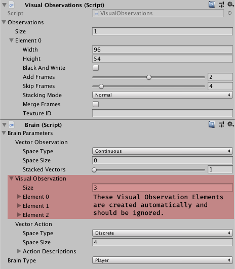

## Frame-Stacking for Unity ML-Agents v0.5

A workaround to enable frame-stacking in [ml-agents v0.5](https://github.com/Unity-Technologies/ml-agents/releases/tag/0.5.0a) environments.
 
### How to use
* Copy [VisualObservations.cs](https://github.com/mbaske/ml-agents-frame-stacking/blob/master/unity-environment/Assets/ML-Agents/Scripts/VisualObservations.cs) and the modified [Agent.cs](https://github.com/mbaske/ml-agents-frame-stacking/blob/master/unity-environment/Assets/ML-Agents/Scripts/Agent.cs) file into your project's /Assets/ML-Agents/Scripts/ directory. 
* Attach the VisualObservations script to a brain.
* Configure your visual observations in the new panel **instead of** the brain parameters panel.

The original ml-agents code relies on the `brainParameters.cameraResolutions` array for handling visual observations. The VisualObservations class populates that array depending on the selected **frame-stacking options**:

* **Add Frames** - The number of additional frames. 0 disables frame-stacking.
* **Skip Frames** - The number of frames inbetween additional frames (delay time).
* **Stacking Mode**
* -- **Normal** - Buffered frames are added to the current camera image. [ 1 + Add Frames ]
* -- **Subtract** - Pixel-subtracts consecutive frames to remove static contents. [ 1 + Add Frames ]
* -- **Motion** - Like Difference but frames are combined into a single texture. [ 2 ]
* -- **Motion Only** - Like Motion but excluding the current camera image. [ 1 ]
* **Merge Frames** - Merges stacked frames into a single large texture. [ 1 ] 
* **Texture ID** - Replaces the camera image with a custom texture (optional).

[ The total number of visual observations per camera ]

If you want to use your own texture rather than a camera, your agent needs to call

	visualObservations.SetCustomTexture("myTextureID", myTexture2D); 
	
The ID must match the inspector field **Texture ID**. Stacking options listed above also apply to custom textures. A demo is included in the test environment's CannonAgent class.

### Example

	Add Frames: 2, Skip Frames: 3, Stacking Mode: Normal
	
	Camera frames  01 02 03 04 05 06 07 08 09 10 11 12 13 14 15 16 .. real-time

	Visual         01 02 03 04 05 06 07 08 09 10 11 12 13 14 15 16 .. real-time
	Observations   -- -- -- -- 01 02 03 04 05 06 07 08 09 10 11 12 .. delayed
	               -- -- -- -- -- -- -- -- 01 02 03 04 05 06 07 08 .. delayed
	            
	-- empty black texture
	
### Test Environment
Open the "Cannon" scene and launch it with Brain Type: Player.
Toggle the agent info screen and change inspector settings for Visual Observations during runtime to see their results. Keyboard controls:

* Toggle agent info: 1 - 9
* Scale visual observations display: + / -
* Move cannon: left / right arrow
* Shoot: space 
